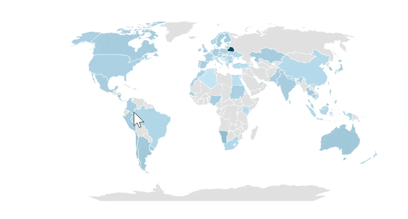
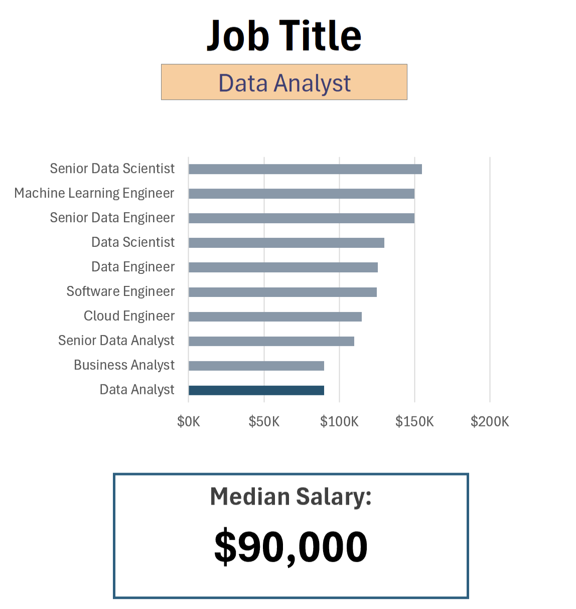
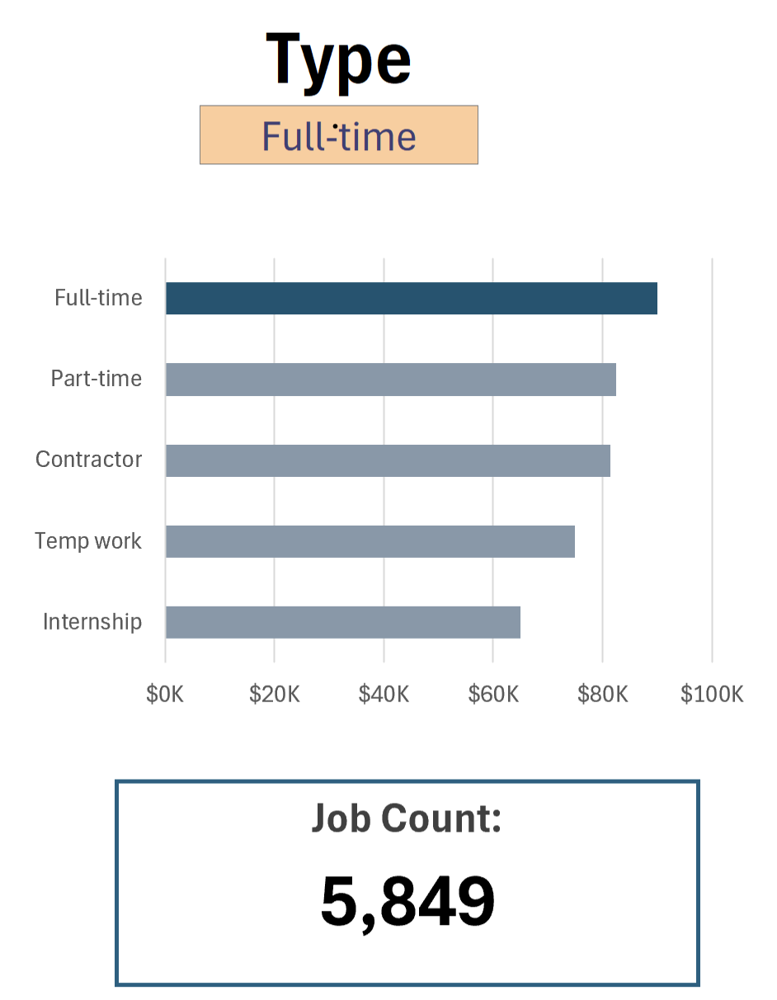

# Excel Salary Dashboard


## Introduction

This data jobs salary dashboard was created to help job seekers investigate salaries for their desired jobs and ensure they are being adequately compensated.

The data is from my Excel course, which provides a foundation in analyzing data using this powerful tool. The data contains detailed information on job titles, salaries, locations, and essential skills that are presented here.

### Dashboard File

My final dashboard is in [1\_Salary\_Dashboard.xlsx](1_Salary_Dashboard.xlsx).

### Excel Skills Used

The following Excel skills were utilized for analysis:

* **📉 Charts**
* **🧮 Formulas and Functions**
* **❎ Data Validation**

### Data Jobs Dataset

The dataset used for this project contains real-world data science job information from 2023. It includes detailed information on:

* **👨‍💼 Job titles**
* **💰 Salaries**
* **📍 Locations**
* **🛠️ Skills**

## Dashboard Build

### 📉 Charts

#### 📊 Data Science Job Salaries - Bar Chart


* 🛠️ **Excel Features:** Utilized bar chart feature (with formatted salary values) and optimized layout for clarity.
* 🎨 **Design Choice:** Horizontal bar chart for visual comparison of median salaries.
* 📉 **Data Organization:** Sorted job titles by descending salary for improved readability.
* 💡 **Insights Gained:** Enables quick identification of salary trends—Senior roles and Engineers earn more than Analysts.

#### 🗺️ Country Median Salaries - Map Chart



* 🛠️ **Excel Features:** Used Excel's map chart to plot global median salaries.
* 🎨 **Design Choice:** Color-coded regions to show salary levels.
* 📊 **Data Representation:** Plots median salary by country.
* 💡 **Insights Gained:** Highlights global disparities in salary.

### 🧮 Formulas and Functions

#### 💰 Median Salary by Job Titles

```excel
=MEDIAN(
IF(
    (jobs[job_title_short]=A2)*
    (jobs[job_country]=country)*
    (ISNUMBER(SEARCH(type,jobs[job_schedule_type])))* 
    (jobs[salary_year_avg]<>0),
    jobs[salary_year_avg]
)
)
```

* 🔍 Filters by job title, country, schedule type, and excludes blanks.
* 📊 Returns median salary from matching records.

🍽️ Background Table


📉 Dashboard Implementation



#### ⏰ Count of Job Schedule Type

```excel
=FILTER(J2#,(NOT(ISNUMBER(SEARCH("and",J2#))+ISNUMBER(SEARCH(",",J2#))))*(J2#<>0))
```

* 🔍 Filters out unwanted schedule types and empty values.
* 📋 Returns clean list of unique job types.

🍽️ Background Table


📉 Dashboard Implementation:



### ❎ Data Validation

#### 🔍 Filtered List


* 🎯 Limits inputs for Job Title, Country, and Type using dropdowns
* 🚫 Prevents errors and ensures consistency

## Conclusion

This dashboard provides valuable insights into data job salaries by role and location. Built with Excel using real-world 2023 data, it showcases advanced Excel skills in analysis, visualization, and interactivity.
